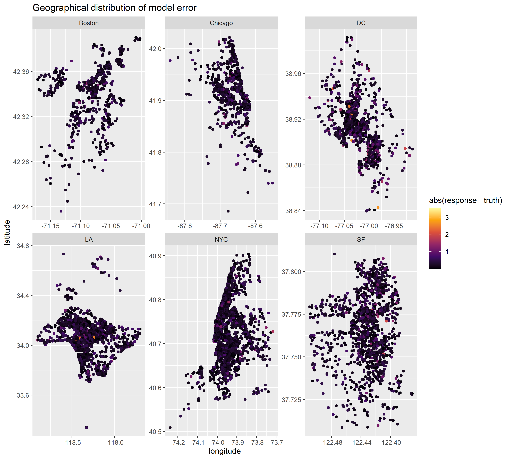
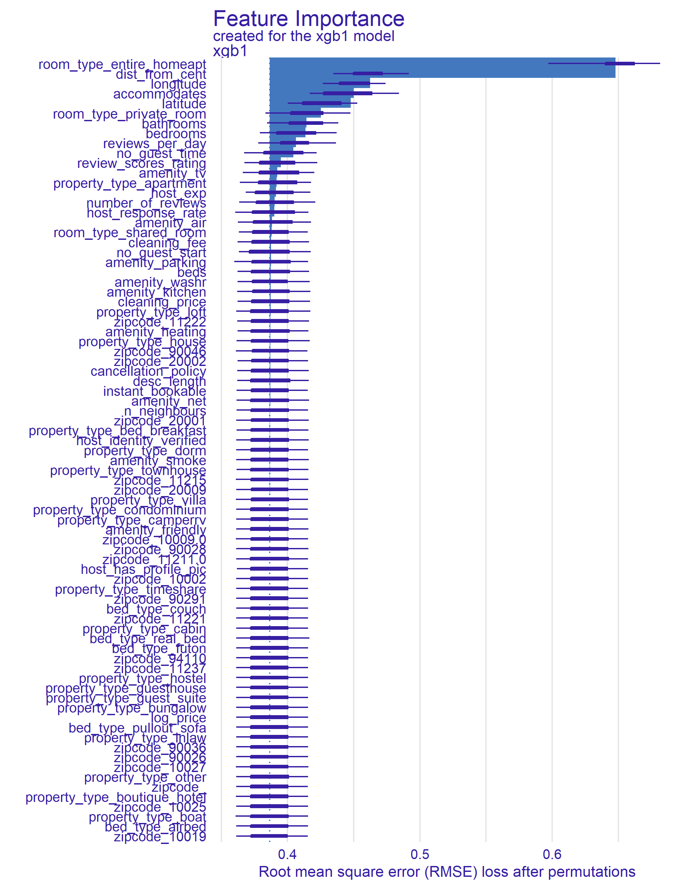
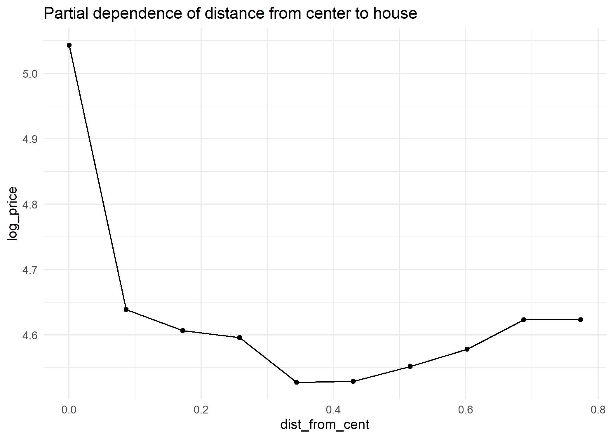

# StudentDataHack

Herein repository is my subsmission to the StudentsDataHack. The hackathon took place on 7th May (24h of coding with preparing this documentation). The problem of the hackathon is following:

Task: Predicting prices of stays

>After a long period of global pandemic and lockdown, more and more people are choosing to spend their vacations in a different way than before. There is more interest in renting facilities by private owners, who can do so through online platforms that are gaining popularity, among others. With the overall increase in travel costs, the price of accommodation is becoming an extremely important factor. Therefore, we have prepared for you a task related to the prediction of prices of stays. Your goal, using data from one of the leading websites of its kind, will be to create an effective model for predicting accommodation prices.

You will be considering:

* Data preprocessing.
* Interpretability of the model.
* Visualisations of the results.
* Overfitting analysis
* Effectiveness of the model (in various metrics)

The final evaluation consists of the code and a presentation that will include the results of the work.

Following part of the README describes my submission.

### Structure of the model workflow

There are 4 R scripts, where only one is independent - glimpse.R. The rest follows a structure:

`data_preproc1.R` -> `feature_eng1.R` -> `modeling1.R`

At the beginning of each of scripts, the previous one is sourced. *To reproduce the results one may clone the repo and run the last file ('modeling1.R')*. Note, the last file trains an xgboost model with CV so it takes some time (but not too long since my computational capabilities were limited at the time).

### Data preprocessing

* Variables `property_type`, `room_type` and `bed_type` were dummy-encoded as number of unique classes is not high
* There is high number of unique amenity and (obviously) zipcode classes, so I took the most frequent ones and also dummy-encoded. Although, the zipcodes may not be too informative
* filtering out dummy variables with high imbalance as rare variances are non-informative
* I dropped name as I did not have enough time to make some informative variables with it
* Other obvious cleaning like changing "t" or "f" to binary or defining correct variable type 

### Feature engineering

Using city variable and coordinates I searched on google for the centers of these cities and introduced a new variable which is an euclidean distance ($\sqrt{(x_2 - x_1)^2 + (y_2 - y_1)^2}$) between house and a city center. This variable turned out very informative as will be later shown.

Another geographical variable is `n_neighbours`. This is basically a number of other houses in the radius of 60 meters. The premise to add it is that the more concentrated competition around the house, the lower the price should be.

Note, that the computational complexity of `n_neighbours` calculation is high (despite the function I used being written in C++ !). That is why I already precalculated it and saved in `data` folder. You can see more in the script `modeling1.R`. Also, as to avoid lookahead bias I calculated number of neighbours in test data based on train data. That is why the calculations are done on the `modeling1.R` file.

I left coordinates as variables. Which at first, the information they add might be ambiguous but on a further thought there potentially could be relation when we control for the city. E.g. further to the west -> closer to the sea -> prices higher. That's why I decided to let the data speak for itself.

Other new variables introduced are:

* `cleaning_price` - an interaction term between `cleaning_fee` and `accommodates`. Which approximates cost of cleaning
* `host_exp` - experience of host, i.e. number of days he/she is offering the house
* `no_gues_start` - time until first guest who left review
* `reviews_per_day`- number of reviews per host experience
* `no_guest_time` - time from last review to last date of review in a data frame (I consider it to be the time of dataset publishing)
* `cancellation_policy` - encoded to ordinar 1:4

### modeling

At the beginning of modeling part I splitted randomly dataset into train and test sets. I would like to split it by time as it can be clearly crucial (due to potential lookahead bias). However I have no information regarding when was price observed. Besides `last_review`, but still cant be sure if the price observation was close to last_review date.

Some variables had NAs, so I imputed them with a linear model based on the variables without NAs. Test set was imputed based on training set to avoid lookahead bias. From what I observed, dropping NAs would be beneficial with respect to the model OOS fitness. However, this can be misleading as NAs might be not-uniformly distributed across data and thus can introduce a bias into the model. 

For the modeling part I decided to use XGBoost algorithm as I had a good experience with it and it's known to have a very good results OOS. Before actual training of the model I have done a cross validation and tuned the hyperparameters of the model with model based optimization (MBO). It takes a lot time on my laptop so be cautious before running.

Given that cross-validation tunes parameters on out of sample performance, I am confident that I did not in fact overfitted the model. However as a robust check I also compared it to the penalized regression and It performed better out of sample than the benchmark model with optimal penalization terms.

#### model evaluation

The model performs very well on the out of sample data. The predictions explain 72% of the actual variance of log prices. The mean absolute error is 0.278 and its median version is as low as 0.209. The benchmark penalized regression with optimal penalization terms has 58% explained variance and 0.349 and 0.272 mean and median absolute error. 

As graph below shows, error of the model are rather uniformly distributed across cities. With a noticable outliers, due to some specific and perhaps unpredictable factors.

However between the cities, there is indeed a difference in model ability to predict. The easiest city to predict in is NYC and the hardest one being DC.

| City          | MAE           | MEDAE |
| ------------- |:-------------:| -----:|
| Boston        | 0.263         | 0.214 |
| Chocago       | 0.284         | 0.22  |
| DC            | 0.373         | 0.264 |
| LA            | 0.273         | 0.204 |
| NYC           | 0.262         | 0.199 |
| SF            | 0.294         | 0.218 |

Another important model analysis is feature importance, which is presented below.

We can clearly see that feature engineering process added a lot of information to the model. Especially the distance from the city center, which is the second most important feature. The raw coordinate variables were apparently also useful, perhaps the model discovered relatonships I was not aware. A little bit lower in the plot, but still important are features made out of host and reviews characteristics. 

It is worth to take a closer look at the distace from the center with the partial dependence plot:

It is impressive how well the nonlinear relationship fits to the theoretical rationale of the variable. Very close to the city center the houses are obviously more expensive, but moreover after some minima in the middle, the price of house increases with the distance. Which is most likely due to the house being rented for holidays far away from center with an appealing natural amenities.
